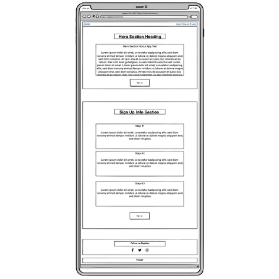
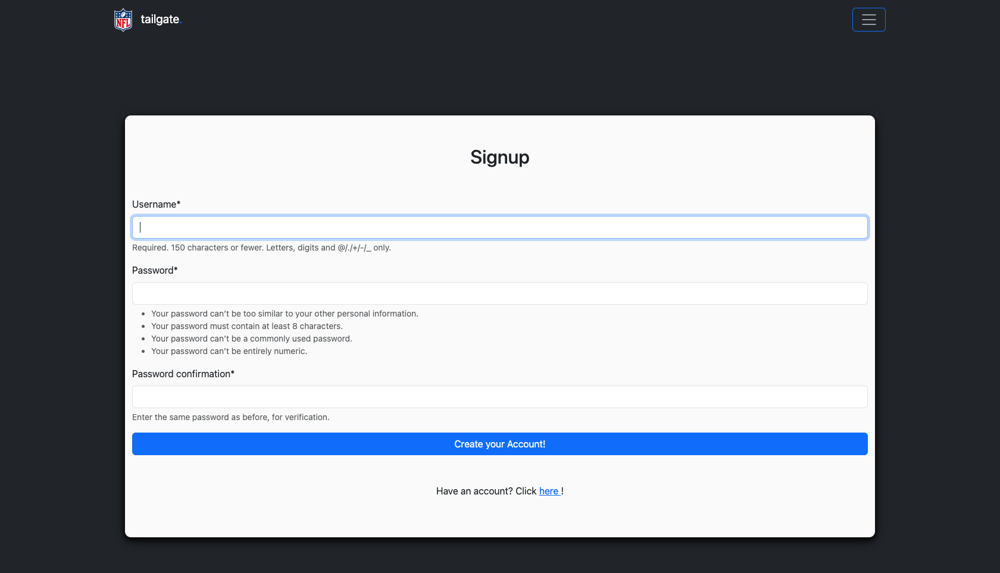
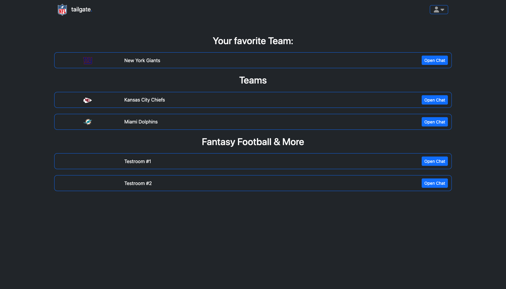
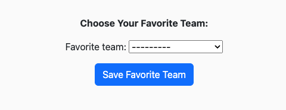

# Welcome to the documentation of "[tailgate.](https://nfl-tailgate-app-1dcb67dfd98a.herokuapp.com)" !

[](https://github.com/firstnamejonas/nfl-tailgate-app/commits/main)
[](https://github.com/firstnamejonas/nfl-tailgate-app/commits/main)
[](https://github.com/firstnamejonas/nfl-tailgate-app)

---


## About

"tailgate." is a virtual fan experience for NFL fans. We all know it, the famous tailgating in front of the NFL teams' stadiums on game days. Fans meet, spend time together and talk about the teams, the game and much more. But obviously not every fan makes it to the stadium and that's why we built "tailgate." for these fans, so that fans who can't make it to the stadium can still interact with other fans online and be part of the community even if they are sitting alone in their living room.

[Click here](https://nfl-tailgate-app-1dcb67dfd98a.herokuapp.com) to experience the "tailgate." App!


## UX

### Colour Scheme

- `#212529` used for primary text and pages background.
- `#fafafa` used for section backgrounds and text on `#212529` backgrounds.
- `#0E6CFD` used for highlights (text & buttons).

### Typography

- I used the 'Bootstrap Native Font Stack' for optimum text rendering on every device and OS. [Read more here!](https://getbootstrap.com/docs/5.3/content/reboot/#native-font-stack)
- [Font Awesome](https://fontawesome.com) icons were used throughout the site, such as the social media icons in the footer.


## User Stories

### Site Users
- As a new site user, I can visit a home page so that I can get more information on what's NFL Tailgate App is all bout and how to sign up.
- As a new user, I can register with my username, an email, set a password and confirm it so that I can access the Tailgate app features.
- As a registered user, I can log in with my username and password so that I can access my account and participate in chats.
- As a new signed up user I can choose my favorite team so that I can participate in the chat room of my favorite team.
- As a logged in user I can got to the main user page where i can find and overview all chats on the app so that can join different chat rooms.
- As a user who joined a chatroom, I can overview a chat interface, so that I can read messages, send messages and go back to all chatsforums.
- As a user in a chatroom, I can send messages in all chat rooms, once entered, except in those chatrooms that are from other teams that are not my favorite team so that I can communicate with other users.
- As a user who sent a message, I can edit or delete my own messages so that I can correct mistakes or remove outdated information.
- As a logged in user, I can update my profile picture so that I can personalize my account.
- As a logged in user I can click on a button or link so that I am able to log out of my account.

### Site Admin
- As a site administrator, I can create new chatrooms, categorize them, and manage existing chatrooms so that I can ensure a well-organized and engaging environment for users.
- As a site administrator, I can delete the accounts of users, if they don't follow the community guidelines so that I can create a safe and harmonic user environment for my page visitors.


## Wireframes

### Mobile Wireframes

| Home | Signup | Login | All Chatrooms Overview | Chatroom | Userprofile |
| --- | --- | --- | --- | --- | --- |
|  |  |  |  |  |  |

### Tablet Wireframes

| Home | Signup | Login | All Chatrooms Overview | Chatroom | Userprofile |
| --- | --- | --- | --- | --- | --- |
|  |  |  |  |  |  |

### Desktop Wireframes

| Home | Signup | Login | All Chatrooms Overview | Chatroom | Userprofile |
| --- | --- | --- | --- | --- | --- |
|  |  |  |  |  |  |


## Features

### Existing Features

| Page | Feature-Title | Feature-Description | Screenshot |
| --- | --- | --- | --- |
| **All Pages** |  |  |  |
|  | Header | The header contains the app logo, which also acts as a link back to the home page. For logged-in users, the logo link leads back to all chats; for users who are not logged in, it leads back to the homepage. There is a navbar menu which contains a link to the homepage, signup page and login page for users who are not logged in. For logged in users the menu includes a link to all chatrooms, user profiles and a logout button. The user will also be labeled with their username at the top of the menu. |  |
| **Home** |  |  |  |
|  | Hero-Section | The Hero Section briefly and concisely describes what the tailgate app is all about. A mockup of the app is also shown. There are two links to the login page and the singup page for simple user navigation. |  |
|  | Sign-Up CTA | In this section the signup process is shown, this section serves as a CTA to acquire new users, therefore there is also a link to the signup page in the section. |  |
|  | Socials | In this section, the user will find links to the social media channels that are displayed with [Font Awesome](https://fontawesome.com) icons. |  |
| **Signup** |  |  |  |
|  | Signup-Form | This form allows new users to register quickly and easily. Instructions are also provided to facilitate the registration process. If the user already has an account, he can click on the link below to go directly to the login. |  |
| **Login** |  |  |  |
|  | Login-Form | This form allows users to log in quickly and easily. If the user does not yet have an account, he can click on the link below to go directly to the signup. |  |
| **All Chatrooms Overview / Main Page for logged in Users** |  |  |  |
|  | Chatrooms-Overview | This feature displays all existing chat rooms to the user. The chat rooms are sorted by category. The chat room of the favorite user team is always at the top, if the user has not yet selected a team, he will receive a message to do so in order to see the chat at the top. Each chatroom is displayed with its name, and if the chatroom is a team chatroom, the logo is also displayed. On the right side of each chatroom field is an obvious link labeled "open chat" for easy user navigation. |  |
| **Chatroom Pages** |  |  |  |
|  | Chatroom-Info | In the upper area of the chat section, the user can see which chatroom he is currently in (chatroom name is displayed). |  |
|  | Leave-Chatroom-Button | To ensure easy user navigation, each chat room has a link button at the top right of the chat section so that the user knows immediately how to leave the chat room. |  |
|  | Chatroom-Refresh | Since the live chat feature is a future feature, the user can simply click on the "Refresh" button to refresh the chat room the user is in to see the latest messages. |  |
|  | Chatroom-Messages | The chatroom messages are displayed in a scroll field so that the page does not become infinitely long. Each message is equipped with the profile picture of the user, the user name, the message and when this message was written. |  |
|  | Chatroom-CRUD | Each user can write a message via the textarea field in the lower part of the chat section and share the message in the respective chatroom via the "Send" button (CREATE). The message is then shared in the chatroom and can be read by all users (READ). If the user wants to edit the message, he can click on the edit icon in his messages and a new page will open where the user can edit the message (UPDATE). If the user wants to delete the message, he can do so by clicking on the delete icon, then he will be redirected to a new page where he can delete the message, just like in the update section (DELETE). |  |
| **Update Message Page** |  |  |  |
|  | Update User Message | Users can access this feature by clicking on the edit icon in their own messages. On this page, the user can quickly and easily edit their message in the text field and confirm the changes with "Save Changes" or return to the chatroom without changes with "Go back". |  |
| **Delete Message Page** |  |  |  |
|  | Delete User Message | Users can access this feature by clicking on the delete icon in their own messages. On this page, the user can see his message that he's about to delete and confirm the process with "Delete" or return to the chatroom without deleting a message with "Go back". |  |
| **Userprofile Page** |  |  |  |
|  | CRUD Profile Picture | The user always has a default profile picture. He can upload a new one and uploads it by clicking on the "Change Picture" button. He can edit it again and again by selecting a new file and clicking the "Change Picture" button again. He can also delete it by selecting the checkbox field "Clean" and then clicking on the "Change Picture" button, then the default picture will be displayed again. |  |
|  | View profile information | With this feature, the user can view his profile information, including the profile picture, the user name and the favorite NFL team selected by him. |  |
|  | Select favorite NFL Team | If the user has not yet selected a favorite team, he can select his favorite NFL team here once. Once selected, it can no longer be changed with the profile. |  |

### Future Features

| Feature-Title | Feature-Description |
| --- | --- |
| Community-Guidelines | In order to create a peaceful and good environment, community guidelines should be created in the future that users must adhere to or their access will be revoked. |

## Tools & Technologies Used

- [](https://git-scm.com) used for version control. (`git add`, `git commit`, `git push`)
- [](https://github.com) used for secure online code storage.
- [](https://gitpod.io) used as a cloud-based IDE for development.
- [](https://en.wikipedia.org/wiki/HTML) used for the main site content.
- [](https://en.wikipedia.org/wiki/CSS) used for the main site design and layout.
- [](https://www.javascript.com) used for user interaction on the site.
- [](https://www.python.org) used as the back-end programming language.
- [](https://www.heroku.com) used for hosting the deployed back-end site.
- [](https://getbootstrap.com) used as the front-end CSS framework for modern responsiveness and pre-built components.
- [](https://www.djangoproject.com) used as the Python framework for the site.
- [](https://dbs.ci-dbs.net) used as the Postgres database from Code Institute.
- [](https://cloudinary.com) used for online static file storage.
- [](https://whitenoise.readthedocs.io) used for serving static files with Heroku.
- [](https://balsamiq.com/wireframes) used for creating wireframes.


## Database Design

❗️❗️❗️❗️❗️❗️❗️❗️❗️❗️❗️❗️❗️❗️❗️❗️❗️❗️❗️❗️❗️❗️


## Agile Development Process

### GitHub Projects

[GitHub Projects](https://github.com/firstnamejonas/nfl-tailgate-app/projects) served as an Agile tool for this project.
It isn't a specialized tool, but with the right tags and project creation/issue assignments, it can be made to work.

Through it, user stories, issues, and milestone tasks were planned, then tracked on a weekly basis using the basic Kanban board.

### GitHub Issues

[GitHub Issues](https://github.com/firstnamejonas/nfl-tailgate-app/issues) served as an another Agile tool.
There, I used my own **User Story Template** to manage user stories.

It also helped with milestone iterations on a weekly basis.

- [Open Issues](https://github.com/firstnamejonas/nfl-tailgate-app/issues) [](https://github.com/firstnamejonas/nfl-tailgate-app/issues)

    

- [Closed Issues](https://github.com/firstnamejonas/nfl-tailgate-app/issues?q=is%3Aissue+is%3Aclosed) [](https://github.com/firstnamejonas/nfl-tailgate-app/issues?q=is%3Aissue+is%3Aclosed)

    

### MoSCoW Prioritization

I've decomposed my Epics into stories prior to prioritizing and implementing them.
Using this approach, I was able to apply the MoSCow prioritization and labels to my user stories within the Issues tab.

- **Must Have**: guaranteed to be delivered (*max 60% of stories*)
- **Should Have**: adds significant value, but not vital (*the rest ~20% of stories*)
- **Could Have**: has small impact if left out (*20% of stories*)
- **Won't Have**: not a priority for this iteration


## Testing
> [!NOTE]  
> For all testing, please refer to the [TESTING.md](TESTING.md) file.


## Deployment

The live deployed application can be found deployed on [Heroku](https://nfl-tailgate-app-1dcb67dfd98a.herokuapp.com).

### PostgreSQL Database

This project uses a [Code Institute PostgreSQL Database](https://dbs.ci-dbs.net).

To obtain my own Postgres Database from Code Institute, I followed these steps:

- Signed-in to the CI LMS using my email address.
- An email was sent to me with my new Postgres Database.

> [!CAUTION]  
> - PostgreSQL databases by Code Institute are only available to CI Students.
> - You must acquire your own PostgreSQL database through some other method
> if you plan to clone/fork this repository.
> - Code Institute students are allowed a maximum of 8 databases.
> - Databases are subject to deletion after 18 months.

### Cloudinary API

This project uses the [Cloudinary API](https://cloudinary.com) to store media assets online, due to the fact that Heroku doesn't persist this type of data.

To obtain your own Cloudinary API key, create an account and log in.

- For *Primary interest*, you can choose *Programmable Media for image and video API*.
- Optional: *edit your assigned cloud name to something more memorable*.
- On your Cloudinary Dashboard, you can copy your **API Environment Variable**.
- Be sure to remove the `CLOUDINARY_URL=` as part of the API **value**; this is the **key**.

### Heroku Deployment

This project uses [Heroku](https://www.heroku.com), a platform as a service (PaaS) that enables developers to build, run, and operate applications entirely in the cloud.

Deployment steps are as follows, after account setup:

- Select **New** in the top-right corner of your Heroku Dashboard, and select **Create new app** from the dropdown menu.
- Your app name must be unique, and then choose a region closest to you (EU or USA), and finally, select **Create App**.
- From the new app **Settings**, click **Reveal Config Vars**, and set your environment variables.

> [!IMPORTANT]  
> This is a sample only; you would replace the values with your own if cloning/forking my repository.

| Key | Value |
| --- | --- |
| `CLOUDINARY_URL` | user's own value |
| `DATABASE_URL` | user's own value |
| `DISABLE_COLLECTSTATIC` | 1 (*this is temporary, and can be removed for the final deployment*) |
| `SECRET_KEY` | user's own value |

Heroku needs three additional files in order to deploy properly.

- requirements.txt
- Procfile
- runtime.txt

You can install this project's **requirements** (where applicable) using:

- `pip3 install -r requirements.txt`

If you have your own packages that have been installed, then the requirements file needs updated using:

- `pip3 freeze --local > requirements.txt`

The **Procfile** can be created with the following command:

- `echo web: gunicorn app_name.wsgi > Procfile`
- *replace **app_name** with the name of your primary Django app name; the folder where settings.py is located*

The **runtime.txt** file needs to know which Python version you're using:
1. type: `python3 --version` in the terminal.
2. in the **runtime.txt** file, add your Python version:
	- `python-3.9.18`

For Heroku deployment, follow these steps to connect your own GitHub repository to the newly created app:

Either:

- Select **Automatic Deployment** from the Heroku app.

Or:

- In the Terminal/CLI, connect to Heroku using this command: `heroku login -i`
- Set the remote for Heroku: `heroku git:remote -a app_name` (replace *app_name* with your app name)
- After performing the standard Git `add`, `commit`, and `push` to GitHub, you can now type:
	- `git push heroku main`

The project should now be connected and deployed to Heroku!

### Local Deployment

This project can be cloned or forked in order to make a local copy on your own system.

For either method, you will need to install any applicable packages found within the *requirements.txt* file.

- `pip3 install -r requirements.txt`.

You will need to create a new file called `env.py` at the root-level,
and include the same environment variables listed above from the Heroku deployment steps.

> [!IMPORTANT]  
> This is a sample only; you would replace the values with your own if cloning/forking my repository.

Sample `env.py` file:

```python
import os

os.environ.setdefault("CLOUDINARY_URL", "user's own value")
os.environ.setdefault("DATABASE_URL", "user's own value")
os.environ.setdefault("SECRET_KEY", "user's own value")

# local environment only (do not include these in production/deployment!)
os.environ.setdefault("DEBUG", "True")
```

Once the project is cloned or forked, in order to run it locally, you'll need to follow these steps:

- Start the Django app: `python3 manage.py runserver`
- Stop the app once it's loaded: `CTRL+C` or `⌘+C` (Mac)
- Make any necessary migrations: `python3 manage.py makemigrations`
- Migrate the data to the database: `python3 manage.py migrate`
- Create a superuser: `python3 manage.py createsuperuser`
- Load fixtures (if applicable): `python3 manage.py loaddata file-name.json` (repeat for each file)
- Everything should be ready now, so run the Django app again: `python3 manage.py runserver`

#### Cloning

You can clone the repository by following these steps:

1. Go to the [GitHub repository](https://github.com/firstnamejonas/nfl-tailgate-app) 
2. Locate the Code button above the list of files and click it 
3. Select if you prefer to clone using HTTPS, SSH, or GitHub CLI and click the copy button to copy the URL to your clipboard
4. Open Git Bash or Terminal
5. Change the current working directory to the one where you want the cloned directory
6. In your IDE Terminal, type the following command to clone my repository:
	- `git clone https://github.com/firstnamejonas/nfl-tailgate-app.git`
7. Press Enter to create your local clone.

Alternatively, if using Gitpod, you can click below to create your own workspace using this repository.

[](https://gitpod.io/#https://github.com/firstnamejonas/nfl-tailgate-app)

Please note that in order to directly open the project in Gitpod, you need to have the browser extension installed.
A tutorial on how to do that can be found [here](https://www.gitpod.io/docs/configure/user-settings/browser-extension).

#### Forking

By forking the GitHub Repository, we make a copy of the original repository on our GitHub account to view and/or make changes without affecting the original owner's repository.
You can fork this repository by using the following steps:

1. Log in to GitHub and locate the [GitHub Repository](https://github.com/firstnamejonas/nfl-tailgate-app)
2. At the top of the Repository (not top of page) just above the "Settings" Button on the menu, locate the "Fork" Button.
3. Once clicked, you should now have a copy of the original repository in your own GitHub account!

### Local VS Deployment

There were no differences found.


## Credits

### Content
| Source | Location | Notes |
| --- | --- | --- |
| [Markdown Builder](https://tim.2bn.dev/markdown-builder) | README and TESTING | tool to help generate the Markdown files |
| [LearnDjango](https://learndjango.com/tutorials/django-login-and-logout-tutorial#create-a-homepage) | Login / Signup / Logout | Support to setup the User Login, Signup & Logout |
| [Tech With Tim](https://www.youtube.com/watch?v=WuyKxdLcw3w) | Login / Signup | Support to style the User Login & Signup Forms |
| [Sharma Coder](https://www.youtube.com/watch?v=8kBo91L8JTY) | Success Message after User Signup on Login-Page | Support to setup flash message in django |
| [CodeInstitute](https://learn.codeinstitute.net/dashboard) | Chatrooms | Support to setup Rooms & Chat Functions |
| [Traversy Media](https://www.youtube.com/watch?v=PtQiiknWUcI&t=21842s) | Edit / Delete Chat Messages | Support to setup feature to edit and / or delete chat messages |


### Media
| Source | Location | Type | Notes |
| --- | --- | --- | --- |
| [Pexels](https://www.pexels.com) | entire site | image | favicon on all pages |

### Acknowledgements
- I would like to thank my family & my partner Caro, for believing in me, and allowing me to make this transition into software development.
- I would like to thank my Code Institute mentor, [Tim Nelson](https://github.com/TravelTimN) for his support throughout the development of this project.
- I would like to thank the [Code Institute Slack community](https://code-institute-room.slack.com) for the moral support; it kept me going during periods of self doubt and imposter syndrome.
