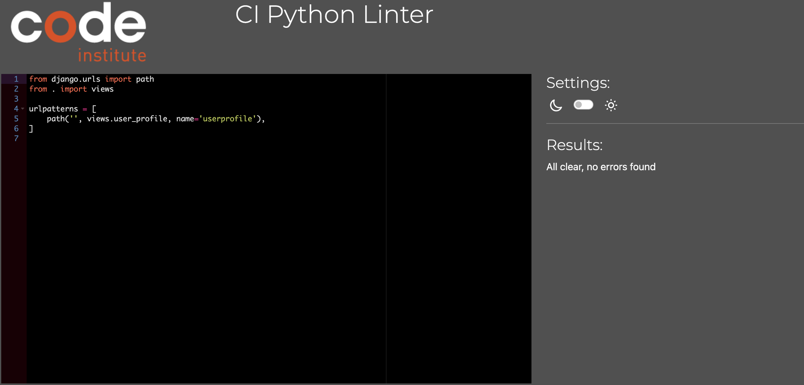
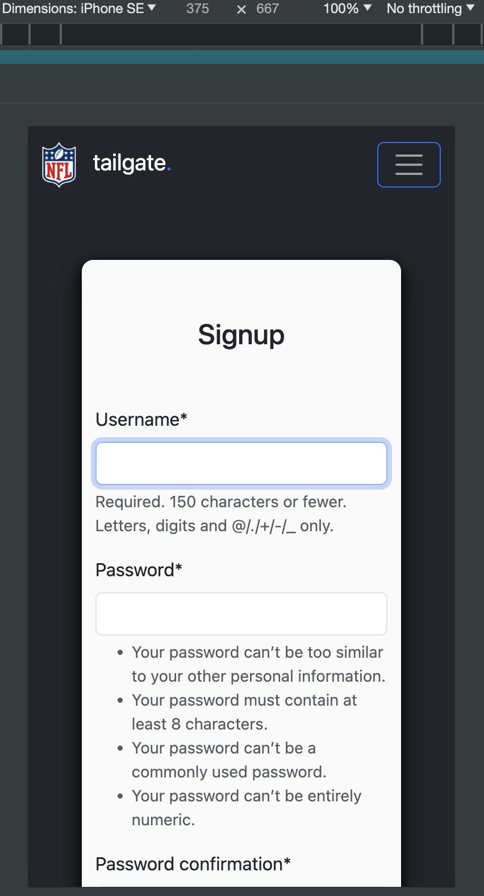

# Testing

> [!NOTE]  
> Return back to the [README.md](README.md) file.

## Code Validation

### HTML

I have used the recommended [HTML W3C Validator](https://validator.w3.org) to validate all of my HTML files.

| Directory | File | W3C URL | Screenshot | Notes |
| --- | --- | --- | --- | --- |
| templates | base.html | [Click here!](https://validator.w3.org/nu/?doc=https%3A%2F%2Fnfl-tailgate-app-1dcb67dfd98a.herokuapp.com%2F) |  | No errors or warnings to show. |
| templates | chat.html | [Click here!](https://validator.w3.org/nu/?doc=https%3A%2F%2Fnfl-tailgate-app-1dcb67dfd98a.herokuapp.com%2Fchat%2Fnew_york_giants_chatroom%2F) |  | No errors or warnings to show. |
| templates | chatrooms.html | [Click here!](https://validator.w3.org/nu/?doc=https%3A%2F%2Fnfl-tailgate-app-1dcb67dfd98a.herokuapp.com%2Fchatrooms) |  | No errors or warnings to show. |
| templates | delete_message.html | [Click here!](https://validator.w3.org/nu/?doc=https%3A%2F%2Fnfl-tailgate-app-1dcb67dfd98a.herokuapp.com%2Fchat%2Fdelete%2F19%2F) |  | No errors or warnings to show. |
| templates | edit_message.html | [Click here!](https://validator.w3.org/nu/?doc=https%3A%2F%2Fnfl-tailgate-app-1dcb67dfd98a.herokuapp.com%2Fchat%2Fedit%2F19%2F) |  | No errors or warnings to show. |
| templates | home.html | [Click here!](https://validator.w3.org/nu/?doc=https%3A%2F%2Fnfl-tailgate-app-1dcb67dfd98a.herokuapp.com%2F) |  | No errors or warnings to show. |
| templates | login.html | [Click here!](https://validator.w3.org/nu/?doc=https%3A%2F%2Fnfl-tailgate-app-1dcb67dfd98a.herokuapp.com%2Faccounts%2Flogin%2F) |  | No errors or warnings to show. |
| templates | signup.html | [Click here!](https://validator.w3.org/nu/?doc=https%3A%2F%2Fnfl-tailgate-app-1dcb67dfd98a.herokuapp.com%2Faccounts%2Fsignup%2F) |  | No errors or warnings to show. |
| templates | user_profile.html | [Click here!](https://validator.w3.org/nu/?doc=https%3A%2F%2Fnfl-tailgate-app-1dcb67dfd98a.herokuapp.com%2Fuserprofile) |  | No errors or warnings to show. |

### CSS

I have used the recommended [CSS Jigsaw Validator](https://jigsaw.w3.org/css-validator) to validate all of my CSS files.

| Directory | File | Screenshot | Notes |
| --- | --- | --- | --- |
| static/css | style.css |  | No errors or warnings to show. |

### JavaScript

I have used the recommended [JShint Validator](https://jshint.com) to validate all of my JS files.

| Directory | File | Screenshot | Notes |
| --- | --- | --- | --- |
| static/js | script.js |  | No errors or warnings to show. |

### Python

I have used the recommended [PEP8 CI Python Linter](https://pep8ci.herokuapp.com) to validate all of my Python files.

| Directory | File | CI URL | Screenshot | Notes |
| --- | --- | --- | --- | --- |
| accounts | admin.py | --- | --- | No code to be validated! |
| accounts | models.py | --- | --- | No code to be validated! |
| accounts | urls.py | [PEP8 CI](https://pep8ci.herokuapp.com/https://raw.githubusercontent.com/firstnamejonas/nfl-tailgate-app/main/accounts/urls.py) |  | All clear, no errors found! |
| accounts | views.py | [PEP8 CI](https://pep8ci.herokuapp.com/https://raw.githubusercontent.com/firstnamejonas/nfl-tailgate-app/main/accounts/views.py) |  | 34: E501 line too long (99 > 79 characters). This is due to a long flash message which has to stay together and can not be seperated. |
| chat | admin.py | --- | --- | No code to be validated! |
| chat | models.py | [PEP8 CI](https://pep8ci.herokuapp.com/https://raw.githubusercontent.com/firstnamejonas/nfl-tailgate-app/main/chat/models.py) |  | All clear, no errors found! |
| chat | urls.py | [PEP8 CI](https://pep8ci.herokuapp.com/https://raw.githubusercontent.com/firstnamejonas/nfl-tailgate-app/main/chat/urls.py) |  | All clear, no errors found! |
| chat | views.py | [PEP8 CI](https://pep8ci.herokuapp.com/https://raw.githubusercontent.com/firstnamejonas/nfl-tailgate-app/main/chat/views.py) |  | All clear, no errors found! |
| chatrooms | admin.py | [PEP8 CI](https://pep8ci.herokuapp.com/https://raw.githubusercontent.com/firstnamejonas/nfl-tailgate-app/main/chatrooms/admin.py) |  | All clear, no errors found! |
| chatrooms | models.py | [PEP8 CI](https://pep8ci.herokuapp.com/https://raw.githubusercontent.com/firstnamejonas/nfl-tailgate-app/main/chatrooms/models.py) |  | All clear, no errors found! |
| chatrooms | urls.py | [PEP8 CI](https://pep8ci.herokuapp.com/https://raw.githubusercontent.com/firstnamejonas/nfl-tailgate-app/main/chatrooms/urls.py) |  | All clear, no errors found! |
| chatrooms | views.py | [PEP8 CI](https://pep8ci.herokuapp.com/https://raw.githubusercontent.com/firstnamejonas/nfl-tailgate-app/main/chatrooms/views.py) |  | All clear, no errors found! |
| main | settings.py | [PEP8 CI](https://pep8ci.herokuapp.com/https://raw.githubusercontent.com/firstnamejonas/nfl-tailgate-app/main/main/settings.py) |  | 115, 118, 121, 124 E501 line too long. This does not effect the code. |
| main | urls.py | [PEP8 CI](https://pep8ci.herokuapp.com/https://raw.githubusercontent.com/firstnamejonas/nfl-tailgate-app/main/main/urls.py) |  | All clear, no errors found! |
|  | manage.py | [PEP8 CI](https://pep8ci.herokuapp.com/https://raw.githubusercontent.com/firstnamejonas/nfl-tailgate-app/main/manage.py) |  | All clear, no errors found! |
| userprofile | admin.py | [PEP8 CI](https://pep8ci.herokuapp.com/https://raw.githubusercontent.com/firstnamejonas/nfl-tailgate-app/main/userprofile/admin.py) |  | All clear, no errors found! |
| userprofile | forms.py | [PEP8 CI](https://pep8ci.herokuapp.com/https://raw.githubusercontent.com/firstnamejonas/nfl-tailgate-app/main/userprofile/forms.py) |  | All clear, no errors found! |
| userprofile | models.py | [PEP8 CI](https://pep8ci.herokuapp.com/https://raw.githubusercontent.com/firstnamejonas/nfl-tailgate-app/main/userprofile/models.py) |  | 21: E501 line too long (159 > 79 characters). This is due to a long link but does not effect anything. |
| userprofile | signals.py | [PEP8 CI](https://pep8ci.herokuapp.com/https://raw.githubusercontent.com/firstnamejonas/nfl-tailgate-app/main/userprofile/signals.py) |  | All clear, no errors found! |
| userprofile | urls.py | [PEP8 CI](https://pep8ci.herokuapp.com/https://raw.githubusercontent.com/firstnamejonas/nfl-tailgate-app/main/userprofile/urls.py) |  | All clear, no errors found! |
| userprofile | views.py | [PEP8 CI](https://pep8ci.herokuapp.com/https://raw.githubusercontent.com/firstnamejonas/nfl-tailgate-app/main/userprofile/views.py) |  | All clear, no errors found! |

## Browser Compatibility

I've tested my deployed project on multiple browsers to check for compatibility issues.

| Browser | Home | Signup | Login | Chatrooms | Chatroom | User Profile | Delete Chat Messages | Edit Chat Messages |  Notes |
| --- | --- | --- | --- | --- | --- | --- | --- | --- | --- |
| Chrome |  |  |  |  |  |  |  |  | Works as expected! |
| Firefox |  |  |  |  |  |  |  |  | Works as expected |
| Safari |  |  |  |  |  |  |  |  | Works as expected |

## Responsiveness

I've tested my deployed project on multiple devices to check for responsiveness issues.

| Device | Home | Signup | Login | Chatrooms | Chatroom | User Profile | Delete Chat Messages | Edit Chat Messages |  Notes |
| --- | --- | --- | --- | --- | --- | --- | --- | --- | --- |
| Mobile (DevTools) |  |  |  |  |  |  |  |  | Works as expected! |
| Tablet (DevTools) |  |  |  |  |  |  |  |  | Works as expected! |
| Desktop |  |  |  |  |  |  |  |  | Works as expected! |

## Lighthouse Audit

I've tested my deployed project using the Lighthouse Audit tool to check for any major issues.

| Page | Mobile | Desktop | Notes |
| --- | --- | --- | --- |
| Home |  |  | Some minor warnings |
| Signup |  |  | Some minor warnings |
| Login |  |  | Some minor warnings |
| Chatrooms Overview |  |  | Low "Best Practice" Score due to cloudinary. |
| Chat |  |  | Some minor warnings |
| Edit User Message |  |  | Some minor warnings |
| Delete User Message |  |  | Some minor warnings |
| User Profile |  |  | Low "Best Practice" Score due to cloudinary. |
