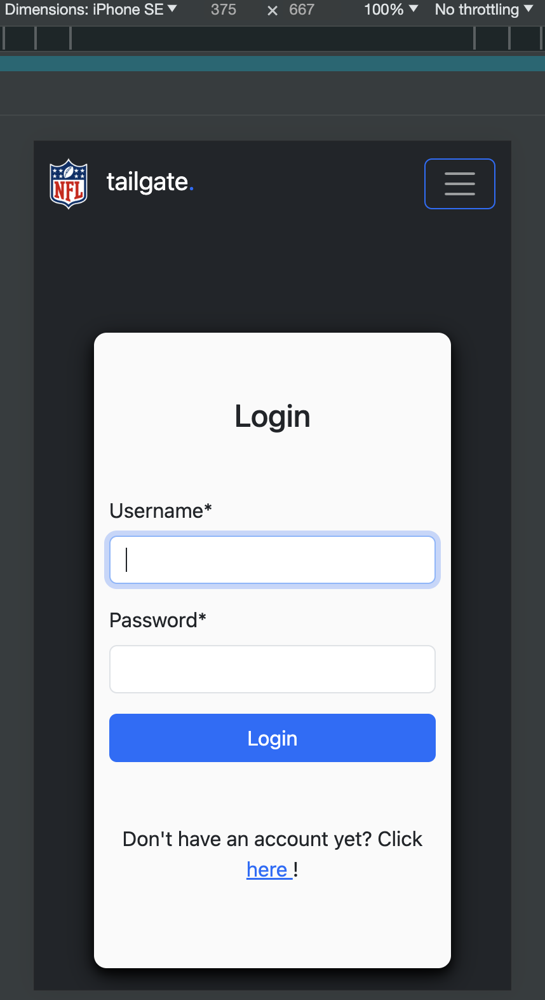
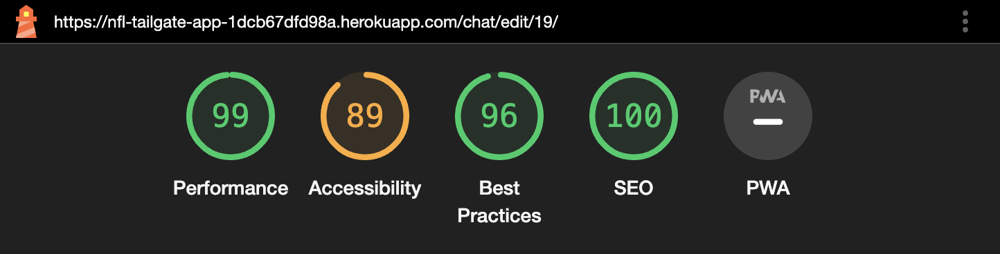
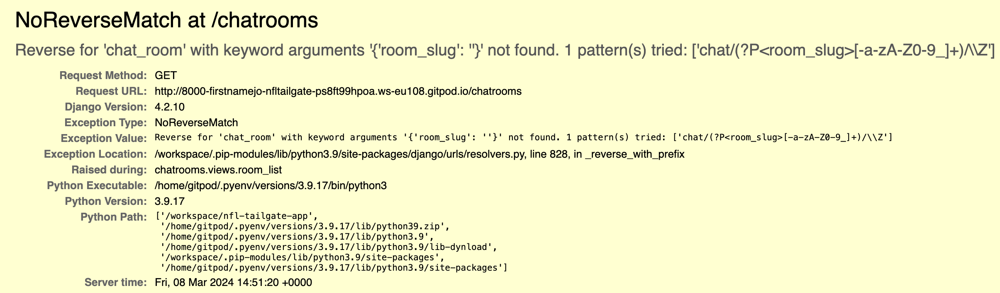
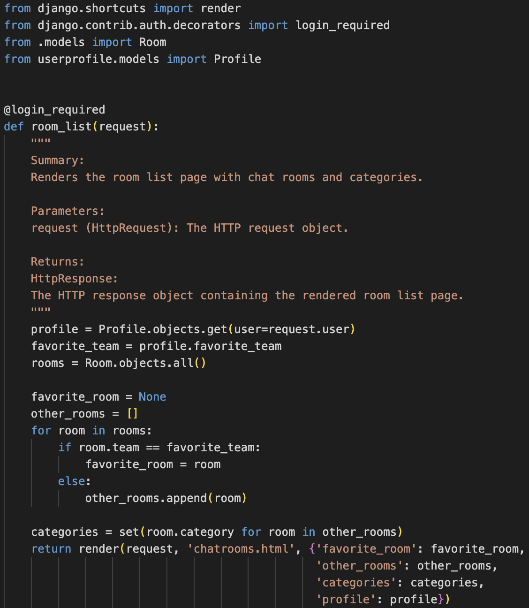

# Testing

> [!NOTE]  
> Return back to the [README.md](README.md) file.

## Code Validation

### HTML

I have used the recommended [HTML W3C Validator](https://validator.w3.org) to validate all of my HTML files.

| Directory | File | W3C URL | Screenshot | Notes |
| --- | --- | --- | --- | --- |
| templates | base.html | [Click here!](https://validator.w3.org/nu/?doc=https%3A%2F%2Fnfl-tailgate-app-1dcb67dfd98a.herokuapp.com%2F) |  | No errors or warnings to show. |
| templates | chat.html | [Click here!](https://validator.w3.org/nu/?doc=https%3A%2F%2Fnfl-tailgate-app-1dcb67dfd98a.herokuapp.com%2Fchat%2Fnew_york_giants_chatroom%2F) |  | No errors or warnings to show. |
| templates | chatrooms.html | [Click here!](https://validator.w3.org/nu/?doc=https%3A%2F%2Fnfl-tailgate-app-1dcb67dfd98a.herokuapp.com%2Fchatrooms) |  | No errors or warnings to show. |
| templates | delete_message.html | [Click here!](https://validator.w3.org/nu/?doc=https%3A%2F%2Fnfl-tailgate-app-1dcb67dfd98a.herokuapp.com%2Fchat%2Fdelete%2F19%2F) |  | No errors or warnings to show. |
| templates | edit_message.html | [Click here!](https://validator.w3.org/nu/?doc=https%3A%2F%2Fnfl-tailgate-app-1dcb67dfd98a.herokuapp.com%2Fchat%2Fedit%2F19%2F) |  | No errors or warnings to show. |
| templates | home.html | [Click here!](https://validator.w3.org/nu/?doc=https%3A%2F%2Fnfl-tailgate-app-1dcb67dfd98a.herokuapp.com%2F) |  | No errors or warnings to show. |
| templates | login.html | [Click here!](https://validator.w3.org/nu/?doc=https%3A%2F%2Fnfl-tailgate-app-1dcb67dfd98a.herokuapp.com%2Faccounts%2Flogin%2F) |  | No errors or warnings to show. |
| templates | signup.html | [Click here!](https://validator.w3.org/nu/?doc=https%3A%2F%2Fnfl-tailgate-app-1dcb67dfd98a.herokuapp.com%2Faccounts%2Fsignup%2F) |  | No errors or warnings to show. |
| templates | user_profile.html | [Click here!](https://validator.w3.org/nu/?doc=https%3A%2F%2Fnfl-tailgate-app-1dcb67dfd98a.herokuapp.com%2Fuserprofile) |  | No errors or warnings to show. |

### CSS

I have used the recommended [CSS Jigsaw Validator](https://jigsaw.w3.org/css-validator) to validate all of my CSS files.

| Directory | File | Screenshot | Notes |
| --- | --- | --- | --- |
| static/css | style.css |  | No errors or warnings to show. |

### JavaScript

I have used the recommended [JShint Validator](https://jshint.com) to validate all of my JS files.

| Directory | File | Screenshot | Notes |
| --- | --- | --- | --- |
| static/js | script.js |  | No errors or warnings to show. |

### Python

I have used the recommended [PEP8 CI Python Linter](https://pep8ci.herokuapp.com) to validate all of my Python files.

| Directory | File | CI URL | Screenshot | Notes |
| --- | --- | --- | --- | --- |
| accounts | admin.py | --- | --- | No code to be validated! |
| accounts | models.py | --- | --- | No code to be validated! |
| accounts | urls.py | [PEP8 CI](https://pep8ci.herokuapp.com/https://raw.githubusercontent.com/firstnamejonas/nfl-tailgate-app/main/accounts/urls.py) |  | All clear, no errors found! |
| accounts | views.py | [PEP8 CI](https://pep8ci.herokuapp.com/https://raw.githubusercontent.com/firstnamejonas/nfl-tailgate-app/main/accounts/views.py) |  | 34: E501 line too long (99 > 79 characters). This is due to a long flash message which has to stay together and can not be seperated. |
| chat | admin.py | --- | --- | No code to be validated! |
| chat | models.py | [PEP8 CI](https://pep8ci.herokuapp.com/https://raw.githubusercontent.com/firstnamejonas/nfl-tailgate-app/main/chat/models.py) |  | All clear, no errors found! |
| chat | urls.py | [PEP8 CI](https://pep8ci.herokuapp.com/https://raw.githubusercontent.com/firstnamejonas/nfl-tailgate-app/main/chat/urls.py) |  | All clear, no errors found! |
| chat | views.py | [PEP8 CI](https://pep8ci.herokuapp.com/https://raw.githubusercontent.com/firstnamejonas/nfl-tailgate-app/main/chat/views.py) |  | All clear, no errors found! |
| chatrooms | admin.py | [PEP8 CI](https://pep8ci.herokuapp.com/https://raw.githubusercontent.com/firstnamejonas/nfl-tailgate-app/main/chatrooms/admin.py) |  | All clear, no errors found! |
| chatrooms | models.py | [PEP8 CI](https://pep8ci.herokuapp.com/https://raw.githubusercontent.com/firstnamejonas/nfl-tailgate-app/main/chatrooms/models.py) |  | All clear, no errors found! |
| chatrooms | urls.py | [PEP8 CI](https://pep8ci.herokuapp.com/https://raw.githubusercontent.com/firstnamejonas/nfl-tailgate-app/main/chatrooms/urls.py) |  | All clear, no errors found! |
| chatrooms | views.py | [PEP8 CI](https://pep8ci.herokuapp.com/https://raw.githubusercontent.com/firstnamejonas/nfl-tailgate-app/main/chatrooms/views.py) |  | All clear, no errors found! |
| main | settings.py | [PEP8 CI](https://pep8ci.herokuapp.com/https://raw.githubusercontent.com/firstnamejonas/nfl-tailgate-app/main/main/settings.py) |  | 115, 118, 121, 124 E501 line too long. This does not effect the code. |
| main | urls.py | [PEP8 CI](https://pep8ci.herokuapp.com/https://raw.githubusercontent.com/firstnamejonas/nfl-tailgate-app/main/main/urls.py) |  | All clear, no errors found! |
|  | manage.py | [PEP8 CI](https://pep8ci.herokuapp.com/https://raw.githubusercontent.com/firstnamejonas/nfl-tailgate-app/main/manage.py) |  | All clear, no errors found! |
| userprofile | admin.py | [PEP8 CI](https://pep8ci.herokuapp.com/https://raw.githubusercontent.com/firstnamejonas/nfl-tailgate-app/main/userprofile/admin.py) |  | All clear, no errors found! |
| userprofile | forms.py | [PEP8 CI](https://pep8ci.herokuapp.com/https://raw.githubusercontent.com/firstnamejonas/nfl-tailgate-app/main/userprofile/forms.py) |  | All clear, no errors found! |
| userprofile | models.py | [PEP8 CI](https://pep8ci.herokuapp.com/https://raw.githubusercontent.com/firstnamejonas/nfl-tailgate-app/main/userprofile/models.py) |  | 21: E501 line too long (159 > 79 characters). This is due to a long link but does not effect anything. |
| userprofile | signals.py | [PEP8 CI](https://pep8ci.herokuapp.com/https://raw.githubusercontent.com/firstnamejonas/nfl-tailgate-app/main/userprofile/signals.py) |  | All clear, no errors found! |
| userprofile | urls.py | [PEP8 CI](https://pep8ci.herokuapp.com/https://raw.githubusercontent.com/firstnamejonas/nfl-tailgate-app/main/userprofile/urls.py) |  | All clear, no errors found! |
| userprofile | views.py | [PEP8 CI](https://pep8ci.herokuapp.com/https://raw.githubusercontent.com/firstnamejonas/nfl-tailgate-app/main/userprofile/views.py) |  | All clear, no errors found! |

## Browser Compatibility

I've tested my deployed project on multiple browsers to check for compatibility issues.

| Browser | Home | Signup | Login | Chatrooms | Chatroom | User Profile | Delete Chat Messages | Edit Chat Messages |  Notes |
| --- | --- | --- | --- | --- | --- | --- | --- | --- | --- |
| Chrome |  |  |  |  |  |  |  |  | Works as expected! |
| Firefox |  |  |  |  |  |  |  |  | Works as expected |
| Safari |  |  |  |  |  |  |  |  | Works as expected |

## Responsiveness

I've tested my deployed project on multiple devices to check for responsiveness issues.

| Device | Home | Signup | Login | Chatrooms | Chatroom | User Profile | Delete Chat Messages | Edit Chat Messages |  Notes |
| --- | --- | --- | --- | --- | --- | --- | --- | --- | --- |
| Mobile (DevTools) |  |  |  |  |  |  |  |  | Works as expected! |
| Tablet (DevTools) |  |  |  |  |  |  |  |  | Works as expected! |
| Desktop |  |  |  |  |  |  |  |  | Works as expected! |

## Lighthouse Audit

I've tested my deployed project using the Lighthouse Audit tool to check for any major issues.

| Page | Mobile | Desktop | Notes |
| --- | --- | --- | --- |
| Home |  |  | Some minor warnings |
| Signup |  |  | Some minor warnings |
| Login |  |  | Some minor warnings |
| Chatrooms Overview |  |  | Low "Best Practice" Score due to cloudinary. |
| Chat |  |  | Some minor warnings |
| Edit User Message |  |  | Some minor warnings |
| Delete User Message |  |  | Some minor warnings |
| User Profile |  |  | Low "Best Practice" Score due to cloudinary. |

## Defensive Programming

Defensive programming was manually tested with the below user acceptance testing:

| Page | User Action | Expected Result | Pass/Fail | Comments |
| --- | --- | --- | --- | --- |
| All Pages (Logged in User) | --- | --- | --- | --- |
|  | User clicks on Logo | User gets redirected to the Overview Page of all Chatrooms. | Pass | --- |
|  | User clicks on User Icon in Navbar | Sidemenu opens. | Pass | --- |
|  | User clicks on „All Chatrooms“ Link in Menu | User gets redirected to the Overview Page of all Chatrooms. | Pass | --- |
|  | User clicks on „Your Profile“ Link in Menu | User gets redirected to the users profile page. | Pass | --- |
|  | User clicks on „Logout“ Button in Menu | User gets redirected to the homepage & is logged out of the account. | Pass | --- |
| All Pages (Logged out User) | --- | --- | --- | --- |
|  | User clicks on Logo | User gets redirected to the home page. | Pass | --- |
|  | User clicks on Menu Icon in Navbar | Sidemenu opens. | Pass | --- |
|  | User clicks on „Home“ Link in Menu | User gets redirected to the Homepage. | Pass | --- |
|  | User clicks on „Signup“ Link in Menu | User gets redirected to the Signup Page. | Pass | --- |
|  | User clicks on „Login“ Link in Menu | User gets redirected to the Login Page. | Pass | --- |
| Signup | --- | --- | --- | --- |
|  | User enters Username | Field will accept freeform text | Pass | --- |
|  | Enter valid (same) password (twice) | Field will only accept password format | Pass | --- |
|  | Click on „Signup“ button | User gets redirected to the Login page, displays success flash message. | Pass | --- |
| Login | --- | --- | --- | --- |
| | Enter valid username | Field will only accept valid username. | Pass | --- |
| | Enter valid password | Field will only accept password format. | Pass | --- |
| | Click "Login" button | Redirects user to all chatrooms overview page. | Pass | --- |
| Overview All Chatrooms | --- | --- | --- | --- |
|  | If user has chosen favorite Team it displays first / if not flash message to choose team. | Flash message will appear or "Your favorite Team:" + Team Chatroom will appear first. | Pass | --- |
|  | User clicks "Open Chat" Button. | The chatroom chosen by the users opens. | Pass | --- |
| Chatroom | --- | --- | --- | --- |
|  | User clicks on "Back to all Chats" Button. | User gets redirected to all chatrooms overview page. | Pass | --- |
|  | User clicks on "Refresh" Button. | Chat page reloads & displays new messages in the chatroom. | Pass | --- |
|  | User writes a message within the textarea-field &. clicks on "Send!" Button. | Content (Message) of the User will display in the chat section for all users to see. | Pass | --- |
|  | User clicks on edit icon on his own message. | User gets redirected to the Edit Message Page | Pass | --- |
|  | User clicks on delete icon on his own message. | User gets redirected to the Delete Message Page | Pass | --- |
| Edit User Message | --- | --- | --- | --- |
|  | User changes text in the textarea-field & clicks on "Save Changes" Button. | Updated message is displayed in the chatroom for all users to see. | Pass | --- |
|  | User clicks on "Go Back" Button | User gets redirected to the chatroom page. | Pass | --- |
| Delete User Message | --- | --- | --- | --- |
|  | User clicks on "Delete" Button. | User gets redirected to the chat page & the message disappeared from the chatroom. | Pass | --- |
|  | User clicks on "Go Back" Button | User gets redirected to the chatroom page. | Pass | --- |
| Userprofile | --- | --- | --- | --- |
| --- | User clicks on "Choose File" Button. | User can choose a .jpg / .png file to upload. | Pass | --- |
| --- | User uploads file and clicks on "Change Picture" Button. | User profile picture is updated. | Pass | --- |
| --- | If user hasn't choose favorite team, dropdown appears to choose favorite team. User can choose and click on "Save Favorite Team" Button. | User profile updates & favorite Team displays with Logo & Name. | Pass | --- |

## User Story Testing

| User Story | Screenshot |
| --- | --- |
| As a new site user, I can visit a home page so that I can get more information on what's NFL Tailgate App is all bout and how to sign up. |  |
| As a new user, I can register with my username, set a password and confirm it so that I can access the Tailgate app features. |  |
| As a registered user, I can log in with my username and password so that I can access my account and participate in chats. |  |
| As a new signed up user I can choose my favorite team so that I get a favorite chatroom prioritisation. |    |
| As a logged in user I can go to the main user page where I can find and overview all chats on the app so that I can join different chat rooms. |  |
| As a user who joined a chatroom, I can overview a chat interface, so that I can read messages, send messages and go back to all chatsforums. |  |
| As a user in a chatroom, I can send messages in all chat rooms, once entered, so that I can communicate with other users. |  |
| As a user who sent a message, I can edit or delete my own messages so that I can correct mistakes or remove outdated information. |   |
| As a logged in user, I can update my profile picture so that I can personalize my account. |  |
| As a logged in user I can click on a button or link so that I am able to log out of my account. |  |

## Bugs

| Bug | Screenshots | Solution | Screenshot |
| --- | --- | --- | --- |
| When attempting to change the profile picture in the app by clicking 'Change Picture', the favorite team field is also consistently reset |   | To fix this, I separated the profile form into two forms — one for the picture and one for the team. |  |
| When signing up for a useraccount there was no profile connected with the new user. | --- | To automate it & fix bugs that result out of it, I added two functions to the signals.py file to automate profile-user connection. |  |
| If the User hasn't choose his favorite Team to get the Chat displayed first, he should receive a flash message, that he should set it up and no favorite chat should be displayed. Instead the favorite Chat displayed is just a non team chat, which has the same value as a userprofile that is yet to choose a favorite team. |  | To fix this, I _____________. |  |
| Reverse for 'chat_room' with keyword arguments '{'room_slug': "Y' not found. |  | To fix this, I connected the User Profile with the Rooms over the Team value they have in common, therefore I can use the link of the room, which has a link. |  |

## Unfixed Bugs

> [!NOTE]  
> There are no remaining bugs that I am aware of.
